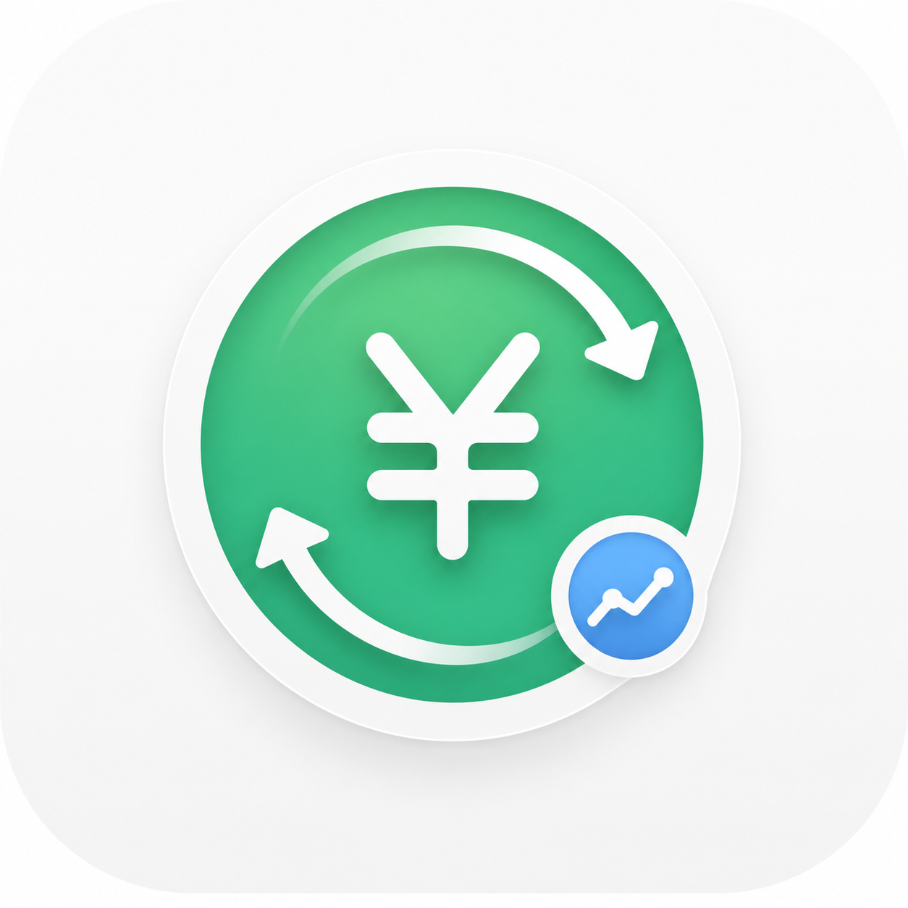

<p align="center">
  
</p>

<h1 align="center">C2CBar</h1>

<p align="center">
  原生 macOS 菜单栏 C2C/P2P 稳定币人民币汇率工具
</p>

<p align="center">
  <a href="https://github.com/murongg/C2CBar/actions/workflows/ci.yml"></a>
  <a href="https://github.com/murongg/C2CBar/releases"></a>
  
  
</p>

C2CBar 是一个原生 SwiftUI 编写的 macOS 菜单栏工具，用来快速查看交易所 C2C/P2P 稳定币人民币入金、出金价格，并和参考 USD/CNY 汇率做溢价对比。

它面向经常需要比较 USDT、USDC 人民币入金/出金价格的国内用户：不用反复打开多个交易所网页，在菜单栏里扫一眼就能看到当前更便宜的买入价、更高的卖出价和对应平台。

## 当前功能

- 菜单栏常驻显示，原生 macOS 浅色 Apple 风格界面
- 支持 USDT、USDC 两个稳定币
- 展示入金最低价、出金最高价和对应交易所
- 展示各平台 C2C/P2P 价格列表
- 对比参考 USD/CNY 汇率，显示入金/出金溢价
- 支持标准、紧凑、极简三种显示模式
- 支持设置刷新频率：1 分钟、15 分钟、30 分钟、1 小时
- 支持持久化设置：显示币种、显示模式、刷新频率、交易所显示/隐藏等
- 支持价格提醒和开机启动
- 支持本地打包为 `.app`，并提供 GitHub Actions CI 和 Release 流程

## 数据源

当前已接入的 C2C/P2P 数据源：

- Binance P2P
- OKX P2P
- HTX OTC

参考汇率数据源：

- Wise USD/CNY
- Frankfurter/ECB USD/CNY

交易所 C2C/P2P 接口通常不是稳定公开 API，后续可能因为接口、风控、地区策略或页面结构变化而需要调整。C2CBar 会尽量保持免登录、免 API Key 的接入方式。

## 运行要求

- macOS 14 或更高版本
- Xcode Command Line Tools
- Swift 6 工具链

安装命令行工具：

```bash
xcode-select --install
```

## 本地运行

```bash
swift run C2CBar
```

如果要验证开机启动、通知权限、Dock 隐藏等更接近真实用户的行为，建议先打包成 `.app` 后再运行。

## 本地打包

```bash
scripts/package.sh
```

打包产物会生成在 `dist/`：

- `dist/C2CBar.app`
- `dist/C2CBar-<version>-macos.dmg`

默认使用 ad-hoc 签名，适合本地测试。公开分发时建议使用 Developer ID 证书签名并完成 notarization。

常用环境变量：

```bash
VERSION=0.1.0 scripts/package.sh
SIGNING_MODE=none scripts/package.sh
SIGNING_MODE=identity SIGN_IDENTITY="Developer ID Application: ..." scripts/package.sh
```

更多发布说明见 [docs/release.md](docs/release.md)。

## GitHub CI 与 Release

仓库包含两个 GitHub Actions 工作流：

- `.github/workflows/ci.yml`：执行测试、release build 和打包产物上传
- `.github/workflows/release.yml`：通过 tag 或手动触发生成 GitHub Release

创建 Release：

```bash
git tag v0.1.0
git push origin v0.1.0
```

## 项目结构

```text
Sources/
  C2CBar/        macOS SwiftUI 菜单栏应用
  C2CBarCore/    市场数据、设置、格式化、业务模型
  C2CBarAssets/  交易所 logo、币种 icon、App icon 等资源
Tests/
  C2CBarCoreTests/
  C2CBarAssetsTests/
scripts/
  package.sh     本地 .app 打包脚本
```

## 免责声明

C2CBar 只用于价格信息聚合和个人决策参考，不构成投资建议、交易建议或汇兑建议。C2C/P2P 价格具有时效性，实际成交价格、限额、支付方式、商家状态和交易风险请以交易所页面为准。
